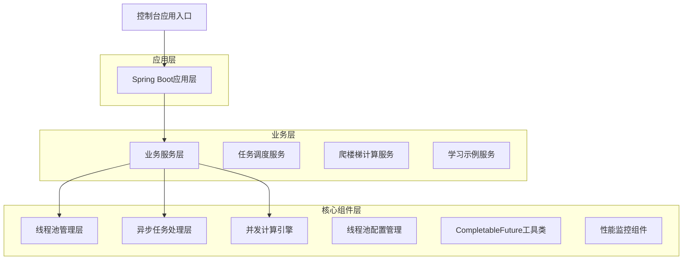
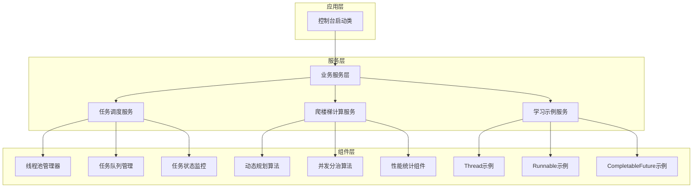
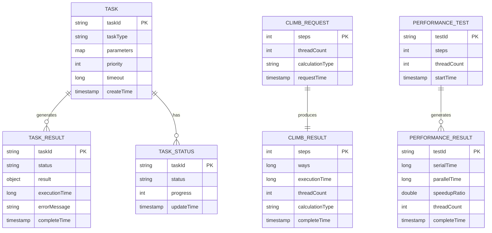

# 多线程学习项目技术架构文档

## 1. 架构设计



## 2. 技术描述

* Frontend: 无（控制台应用）

* Backend: Spring Boot 2.6.13 + Java 11 + Lombok

* 核心技术: Java并发包（java.util.concurrent）+ CompletableFuture

* 工具库: Hutool（时间处理、集合操作等）

## 3. 路由定义

本项目为控制台应用，无Web路由，主要通过不同的启动类和测试方法来演示各个功能模块：

| 启动类/测试类                   | 功能说明                    |
| ------------------------- | ----------------------- |
| ThreadBasicsDemo          | 演示Thread和Runnable的基本用法  |
| ExecutorServiceDemo       | 展示各种线程池的配置和使用           |
| CompletableFutureDemo     | CompletableFuture异步编程示例 |
| TaskSchedulerDemo         | 任务调度器功能演示               |
| ClimbStairsDemo           | 爬楼梯并发计算演示               |
| PerformanceComparisonDemo | 性能对比测试                  |

## 4. API定义

### 4.1 核心服务接口

#### 任务调度服务

```java
// 任务调度接口
public interface TaskSchedulerService {
    // 提交任务
    CompletableFuture<TaskResult> submitTask(TaskRequest request);
    
    // 批量提交任务
    List<CompletableFuture<TaskResult>> submitBatchTasks(List<TaskRequest> requests);
    
    // 获取任务状态
    TaskStatus getTaskStatus(String taskId);
    
    // 取消任务
    boolean cancelTask(String taskId);
}
```

#### 爬楼梯计算服务

```java
// 爬楼梯计算接口
public interface ClimbStairsService {
    // 串行计算
    ClimbResult calculateSerial(int steps);
    
    // 并行计算
    CompletableFuture<ClimbResult> calculateParallel(int steps, int threadCount);
    
    // 性能对比
    PerformanceResult comparePerformance(int steps, int threadCount);
}
```

#### 数据传输对象

**TaskRequest（任务请求）**

| 参数名称       | 参数类型                 | 是否必需  | 描述          |
| ---------- | -------------------- | ----- | ----------- |
| taskId     | String               | true  | 任务唯一标识      |
| taskType   | TaskType             | true  | 任务类型枚举      |
| parameters | Map\<String, Object> | false | 任务参数        |
| priority   | Integer              | false | 任务优先级（1-10） |
| timeout    | Long                 | false | 超时时间（毫秒）    |

**TaskResult（任务结果）**

| 参数名称          | 参数类型       | 描述        |
| ------------- | ---------- | --------- |
| taskId        | String     | 任务标识      |
| status        | TaskStatus | 任务状态      |
| result        | Object     | 执行结果      |
| executionTime | Long       | 执行耗时（毫秒）  |
| errorMessage  | String     | 错误信息（如果有） |

**ClimbResult（爬楼梯计算结果）**

| 参数名称            | 参数类型    | 描述          |
| --------------- | ------- | ----------- |
| steps           | Integer | 楼梯步数        |
| ways            | Long    | 爬楼梯方法数      |
| executionTime   | Long    | 计算耗时（毫秒）    |
| threadCount     | Integer | 使用线程数       |
| calculationType | String  | 计算类型（串行/并行） |

## 5. 服务架构图



## 6. 数据模型

### 6.1 数据模型定义

本项目主要为学习演示项目，不涉及持久化存储，主要使用内存中的数据结构：



### 6.2 数据定义语言

由于本项目不使用数据库，主要使用Java内存数据结构，以下为主要的数据类定义：

```java
// 任务状态枚举
public enum TaskStatus {
    PENDING("待执行"),
    RUNNING("执行中"),
    COMPLETED("已完成"),
    FAILED("执行失败"),
    CANCELLED("已取消");
}

// 任务类型枚举
public enum TaskType {
    COMPUTE("计算任务"),
    IO("IO任务"),
    MIXED("混合任务");
}

// 线程池配置
@Data
public class ThreadPoolConfig {
    private int corePoolSize = 5;
    private int maximumPoolSize = 10;
    private long keepAliveTime = 60L;
    private TimeUnit timeUnit = TimeUnit.SECONDS;
    private int queueCapacity = 100;
    private String threadNamePrefix = "async-task-";
    private RejectedExecutionHandler rejectedExecutionHandler = new ThreadPoolExecutor.CallerRunsPolicy();
}

// 性能监控数据
@Data
public class PerformanceMetrics {
    private long totalTasks;
    private long completedTasks;
    private long failedTasks;
    private double averageExecutionTime;
    private double throughput;
    private LocalDateTime lastUpdateTime;
}
```

