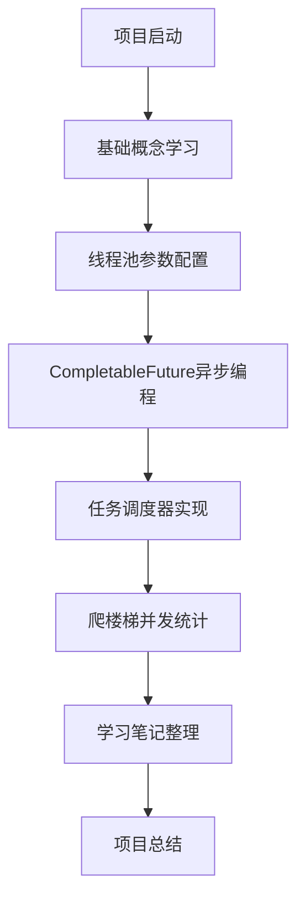

# 多线程 & CompletableFuture 学习项目需求文档

## 1. 产品概述

本项目是一个基于Spring Boot的多线程和异步编程学习项目，旨在深入理解Java并发编程的核心概念和实际应用。

项目通过理论学习和实战演练相结合的方式，帮助开发者掌握Thread、Runnable、ExecutorService和CompletableFuture等关键技术，并通过实际案例加深理解。

## 2. 核心功能

### 2.1 用户角色

本项目为学习型项目，无需区分用户角色，主要面向Java开发者进行多线程编程学习。

### 2.2 功能模块

项目包含以下核心模块：

1. **理论学习模块**：多线程基础概念和线程池参数详解
2. **异步编程模块**：CompletableFuture异步编程实践
3. **任务调度器模块**：基于线程池的任务调度系统
4. **并发统计模块**：爬楼梯问题的并发计算实现
5. **学习笔记模块**：知识点总结和最佳实践

### 2.3 页面详情

| 模块名称 | 功能组件 | 功能描述 |
|---------|---------|----------|
| 理论学习模块 | 线程基础示例 | 演示Thread、Runnable的创建和使用方法 |
| 理论学习模块 | 线程池配置 | 展示ExecutorService各种线程池的配置和参数说明 |
| 异步编程模块 | CompletableFuture基础 | 演示异步任务的创建、组合和异常处理 |
| 异步编程模块 | 异步链式调用 | 实现复杂的异步任务编排和结果处理 |
| 任务调度器模块 | 定时任务管理 | 支持任务的添加、删除、暂停和恢复操作 |
| 任务调度器模块 | 任务执行监控 | 监控任务执行状态、耗时和结果统计 |
| 并发统计模块 | 爬楼梯算法 | 实现动态规划算法的并发计算版本 |
| 并发统计模块 | 性能对比 | 对比串行和并行计算的性能差异 |
| 学习笔记模块 | 知识点总结 | 整理多线程和异步编程的核心概念 |
| 学习笔记模块 | 最佳实践 | 总结实际开发中的经验和注意事项 |

## 3. 核心流程

### 学习流程

1. **基础学习阶段**：从Thread和Runnable开始，逐步学习ExecutorService线程池的使用
2. **进阶学习阶段**：深入学习CompletableFuture异步编程模式和最佳实践
3. **实战演练阶段**：通过任务调度器和爬楼梯并发统计两个实际案例加深理解
4. **总结归纳阶段**：整理学习笔记，形成完整的知识体系

## 4. 用户界面设计

### 4.1 设计风格

- **主色调**：蓝色系（#2196F3）和绿色系（#4CAF50）
- **辅助色**：灰色系（#757575）和橙色系（#FF9800）
- **布局风格**：简洁的控制台输出和日志记录
- **字体**：等宽字体，便于代码和日志的阅读
- **图标风格**：使用简单的ASCII字符和emoji表情

### 4.2 界面设计概览

| 模块名称 | 组件名称 | UI元素 |
|---------|---------|--------|
| 控制台输出 | 日志显示 | 彩色日志输出，不同级别使用不同颜色标识 |
| 性能监控 | 执行统计 | 表格形式展示任务执行时间、成功率等指标 |
| 结果展示 | 数据对比 | 图表形式对比串行和并行计算的性能差异 |

### 4.3 响应性

本项目主要为控制台应用，专注于后端逻辑实现，无需考虑前端响应式设计。